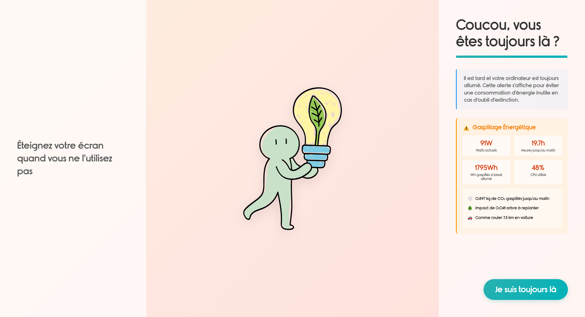

# AutoEcoShutdown




Une application élégante et intuitive pour gérer l'extinction automatique de votre ordinateur, avec des conseils d'économie d'énergie.

## 🌟 Fonctionnalités

- ⏱️ Compte à rebours de 15 minutes avant l'extinction
- 💡 Conseils d'économie d'énergie avec illustrations
- 🎨 Interface moderne et élégante
- 🖥️ Application portable (pas d'installation nécessaire)

## 🚀 Installation

1. Téléchargez la dernière version depuis la section [Releases](https://github.com/Ronnarrdd/AutoEcoShutdown/releases/)
2. Placez `launch.bat` et `AutoEcoShutdown.exe` dans le même dossier
3. Créez une tâche planifiée dans Windows pour exécuter `launch.bat` à l'heure souhaitée

## 🎯 Utilisation

Une fois configurée, l'application :
- S'ouvre automatiquement à l'heure programmée
- Affiche un compte à rebours de 15 minutes
- Vous permet d'annuler l'extinction avec le bouton "Je suis toujours là"

## 📦 Structure des fichiers

```
auto-shutdown/
├── assets/           # Images et ressources
├── main.js          # Processus principal Electron
├── index.html       # Interface utilisateur
└── package.json     # Configuration du projet
```

## 🤝 Contribution

Les contributions sont les bienvenues ! N'hésitez pas à :
- Ouvrir une issue pour signaler un bug
- Proposer une amélioration
- Soumettre une pull request

## 📝 Licence

Ce projet est sous licence ISC. Voir le fichier `LICENSE` pour plus de détails.

## 🙏 Remerciements

- Police Rimouski pour l'élégance typographique
- Chart.js pour le graphique
- Electron pour le framework d'application desktop
- [Écologie stickers](https://www.flaticon.com/fr/stickers-gratuites/ecologie) créés par [paulalee](https://www.flaticon.com/fr/auteurs/paulalee) - [Flaticon](https://www.flaticon.com/fr/)

---

Développé avec ❤️ pour une meilleure gestion de l'énergie 