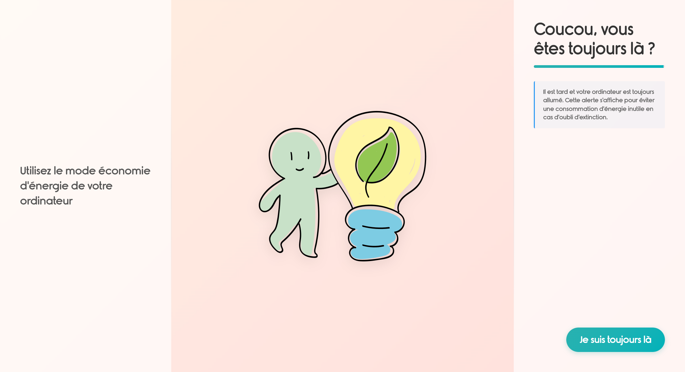

# AutoEcoShutdown




Une application élégante et intuitive pour gérer l'extinction automatique de votre ordinateur, avec des conseils d'économie d'énergie et un tableau de bord écologique montrant l'impact du gaspillage énergétique en temps réel.

## 🌟 Fonctionnalités

- ⏱️ Compte à rebours de 15 minutes avant l'extinction
- 💡 Conseils d'économie d'énergie avec illustrations
- 🎨 Interface moderne et élégante
- 🖥️ Application portable (pas d'installation nécessaire)
- ⚠️ **Nouveau !** Tableau de bord du gaspillage énergétique en temps réel
- 🌍 **Nouveau !** Calcul de l'impact écologique (CO₂, équivalence voiture/arbres)
- 📊 **Nouveau !** Monitoring de la consommation système réelle
- 🌙 **Nouveau !** Projection du gaspillage jusqu'au matin

## 🚀 Installation

1. Téléchargez la dernière version depuis la section [Releases](https://github.com/Ronnarrdd/AutoEcoShutdown/releases/)
2. Placez `launch.bat` et `AutoEcoShutdown.exe` dans le même dossier
3. Créez une tâche planifiée dans Windows pour exécuter `launch.bat` à l'heure souhaitée

## 🎯 Utilisation

- L'application s'ouvre avec un compte à rebours de 15 minutes
- Un message d'avertissement s'affiche à 4 minutes
- Cliquez sur "Rester ici" pour annuler l'extinction (Comme sur un téléviseur !)

## 📦 Structure des fichiers

```
auto-shutdown/
├── assets/           # Images et ressources
├── main.js          # Processus principal Electron
├── index.html       # Interface utilisateur
└── package.json     # Configuration du projet
```

## 🤝 Contribution

Les contributions sont les bienvenues ! N'hésitez pas à :
- Ouvrir une issue pour signaler un bug
- Proposer une amélioration
- Soumettre une pull request

## 📝 Licence

Ce projet est sous licence ISC. Voir le fichier `LICENSE` pour plus de détails.

## 🙏 Remerciements

- Police Rimouski pour l'élégance typographique
- Chart.js pour les graphiques temps réel
- Electron pour le framework d'application desktop
- systeminformation pour les données système réelles
- [Écologie stickers](https://www.flaticon.com/fr/stickers-gratuites/ecologie) créés par [paulalee](https://www.flaticon.com/fr/auteurs/paulalee) - [Flaticon](https://www.flaticon.com/fr/)

---

Développé avec ❤️ pour une meilleure gestion de l'énergie et la préservation de notre planète 🌍
